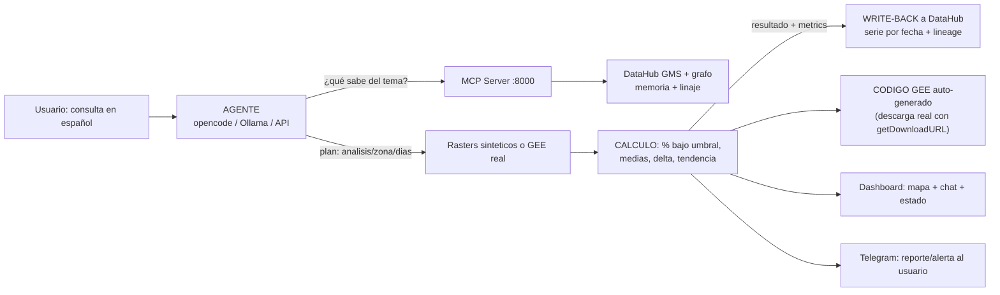

# 🌊 FLUJO INTERNO de Terra Cognita

Cómo viaja una consulta desde el texto libre hasta el reporte en Telegram.
Cada etapa tiene su pieza en el código y se puede ver en vivo con:

```powershell
.venv\Scripts\python.exe scripts\flujo_paso_a_paso.py "dame la vegetacion de Lima de los ultimos 7 dias"
```

## Diagrama



## Paso a paso con código real

| # | Etapa | Código | Qué pasa |
|---|-------|--------|----------|
| 1 | Consulta | `orq.ejecutar("...")` en `orquestador.py` | Recibe el texto libre |
| 2 | Interpretación | `interpretar()` → `_interpretar_opencode` → `_interpretar_ollama` → `_interpretar_llm_api` → heurística | Devuelve `{"analisis", "zona", "dias"}` en JSON. La cadena nunca se rompe |
| 3 | Contexto (no alucinar) | `buscar_contexto_datahub()` → `DataHubMCP.search_datasets` (MCP HTTP :8000) | Pregunta a la "memoria" qué datasets existen del tema antes de actuar |
| 4 | Datos | `generar_serie_ndvi()` / `FuenteData.ndvi()` + `geo/gee.py` | Rasters de N días (sintéticos para demo) o descarga real de Sentinel-2 |
| 5 | Cálculo | `evaluar_tendencia()` / `evaluar_ndvi()` en `geo/analisis.py` | % de área bajo umbral, NDVI medio, delta, estado ALERTA/OBSERVACION/OK |
| 6 | Código GEE | `geo/gee_codegen.py::generar_codigo_gee` | Script JS ad-hoc con bbox pequeño (~2 km), escala y **getDownloadURL** listo |
| 7 | Write-back | `datahub_write/catalogar.py::escribir_serie` / `escribir_resultado` | 1 dataset por fecha + resumen con `upstreamLineage` múltiple en el grafo |
| 8 | Reporte | `cerrar_ciclo()` → `alertas/telegram_bot.py` | Alerta (si riesgo) o reporte siempre (`reporte_siempre: true`) a Telegram |

## Evidencia real (DataHub)

```text
search "tendencia" -> total: 5  (analisis_lima_tendencia_*)
search "lima"      -> total: 22 (incluye raster_lima_2026-08-06, raster_Lima_2026-08-03, ...)
```

Cada resumen de tendencia apunta (linaje) a sus 7 rasters diarios: otro
agente puede heredar el análisis y saber de dónde salió cada número.

## Roles de cada pieza

- **Agente (orquestador)**: interpreta, decide, orquesta y escribe resultados.
- **DataHub MCP**: memoria consultable (datasets, schema, linaje) — evita alucinar.
- **GEE**: datos reales del mundo (Sentinel-2, CHIRPS, SMAP, MODIS) con código generado.
- **DataHub write-back**: documenta el análisis con linaje para otros agentes.
- **Telegram**: cierra el círculo: el agente razona y decide qué avisar.