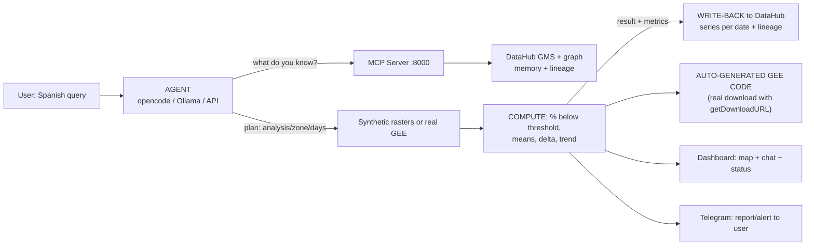

# 🌊 Terra Cognita — INTERNAL FLOW

How a query travels from free text to the Telegram report. Every stage
has its piece of code and can be watched live with:

```powershell
.venv\Scripts\python.exe scripts\flujo_paso_a_paso.py "dame la vegetacion de Lima de los ultimos 7 dias"
```

## Diagram



## Step by step with real code

| # | Stage | Code | What happens |
|---|-------|------|--------------|
| 1 | Query | `orq.ejecutar("...")` in `orquestador.py` | Receives free text |
| 2 | Interpretation | `interpretar()` → `_interpretar_opencode` → `_interpretar_ollama` → `_interpretar_llm_api` → heuristic | Returns `{"analysis", "zone", "days"}` as JSON. The chain never breaks |
| 3 | Context (no hallucination) | `buscar_contexto_datahub()` → `DataHubMCP.search_datasets` (MCP HTTP :8000) | Asks the "memory" which datasets exist before acting |
| 4 | Data | `generar_serie_ndvi()` / `FuenteData.ndvi()` + `geo/gee.py` | N-days rasters (synthetic for the demo) or real Sentinel-2 download |
| 5 | Computation | `evaluar_tendencia()` / `evaluar_ndvi()` in `geo/analisis.py` | % of area below threshold, mean NDVI, delta, state ALERT/WATCH/OK |
| 6 | GEE code | `geo/gee_codegen.py::generar_codigo_gee` | Ad-hoc JS script with small bbox (~2 km), scale and **getDownloadURL** ready |
| 7 | Write-back | `datahub_write/catalogar.py::escribir_serie` / `escribir_resultado` | 1 dataset per date + summary with multiple `upstreamLineage` in the graph |
| 8 | Report | `cerrar_ciclo()` → `alertas/telegram_bot.py` | Alert (if risk) or always-report (`reporte_siempre: true`) to Telegram |

## Real evidence (DataHub)

```text
search "tendencia" -> total: 5  (analisis_lima_tendencia_*)
search "lima"      -> total: 22 (includes raster_lima_2026-08-06, raster_Lima_2026-08-03, ...)
```

Each trend summary points (lineage) to its 7 daily rasters: another
agent can inherit the analysis and know where every number came from.

## Roles of each piece

- **Agent (orchestrator)**: interprets, decides, orchestrates and writes results.
- **DataHub MCP**: queryable memory (datasets, schema, lineage) — avoids hallucination.
- **GEE**: real world data (Sentinel-2, CHIRPS, SMAP, MODIS) with generated code.
- **DataHub write-back**: documents the analysis with lineage for other agents.
- **Telegram**: closes the loop: the agent reasons and decides what to report.